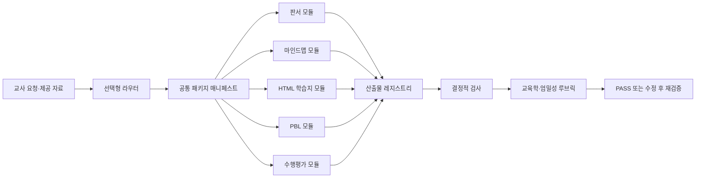

# `class-total-package` 발전적 개선안

> 기준일: 2026-07-30  
> 비교 기준: [`anthropics/k12-teacher-skills`](https://github.com/anthropics/k12-teacher-skills) `main`의 커밋 [`7c03c83`](https://github.com/anthropics/k12-teacher-skills/commit/7c03c83db8223b050b6569ffbe14cd94e229396e)  
> 범위: `class-total-package`와 연결 계약·검증 체계의 개선 계획 수립  
> 비범위: 이번 문서에서 `SKILL.md`·모듈 스킬·외부 플러그인을 실제 변경하거나 설치하지 않음  
> 기존 문서: 2026-07-06의 [IMPROVEMENT_PLAN.md](IMPROVEMENT_PLAN.md)는 완료 이력으로 보존하고 이 문서를 후속 계획으로 사용

> 추가 비교 기준: [`raphysicst-create/korean-secondary-learning-map-mcp`](https://github.com/raphysicst-create/korean-secondary-learning-map-mcp) `main` 및 데이터 매니페스트 `kr-secondary-v0.1` (2026-07-29 생성)

## 1. 결론

현행 스킬의 정체성인 **선택형 번들·라우팅**은 유지한다. Anthropic 저장소의 고정형 Word 패킷이나 미국 성취기준 체계를 그대로 옮기지 않는다.

대신 다음 네 가지를 도입하는 것이 효과가 가장 크다.

1. **공통 패키지 매니페스트**: 앵커 문구뿐 아니라 과제·자료·평가·산출물의 관계를 한 번만 정의하는 내부 정본
2. **실행 가능한 품질 게이트**: 문서형 시나리오를 결정적 검사와 점수형 루브릭으로 전환
3. **교과·학습자 다양성 계약**: 교과별 수업 원리, UDL 기본값, 지원의 점진적 소거, 유연한 집단 편성을 패키지 수준에서 보장
4. **근거·안전·저작권 게이트**: 성취기준 출처 상태, 자료 출처, 개인정보, AI 검증 흔적을 구조화

핵심 방향은 다음과 같다.

> `앵커 문구가 같은 패키지`에서 `과제·자료·평가가 같은 정본을 참조하며 검증되는 패키지`로 발전시킨다.

## 2. 근거와 비교 범위

Anthropic 저장소는 두 개의 직접 스킬과 평가 프레임워크를 제공한다.

- [수업 계획 스킬](https://github.com/anthropics/k12-teacher-skills/blob/7c03c83db8223b050b6569ffbe14cd94e229396e/plugin/skills/k12-lesson-planning/SKILL.md): 교과별 참조 규칙, 성취기준 근거화, 교사용·학생용 자료, 관찰 양식을 하나의 공통 데이터에서 생성
- [수업 차별화 스킬](https://github.com/anthropics/k12-teacher-skills/blob/7c03c83db8223b050b6569ffbe14cd94e229396e/plugin/skills/k12-lesson-differentiation/SKILL.md): 같은 목표와 맥락을 유지하면서 지원 수준을 달리하고, 지원을 점차 줄이며, 유연한 집단 편성을 요구
- [평가 프레임워크](https://github.com/anthropics/k12-teacher-skills/blob/7c03c83db8223b050b6569ffbe14cd94e229396e/evals/README.md): `P` 교육학, `R` 인지적 엄밀성, `O` 산출물·형식, `M` 모델 상호작용으로 나눈 점수형 기준
- 공개된 CSV 기준은 전체 88행이다. 실제 평가는 공통 기준에 해당 교과·조건 기준만 겹쳐 적용한다.
- 저장소는 [Apache-2.0](https://github.com/anthropics/k12-teacher-skills/blob/7c03c83db8223b050b6569ffbe14cd94e229396e/LICENSE)이며 `NOTICE`와 일부 성취기준 관련 별도 고지가 있다.

추가 검토 저장소는 [한국 중등 2022 개정 교육과정 학습 그래프 MCP](https://github.com/raphysicst-create/korean-secondary-learning-map-mcp)다. README와 서버 계약 기준으로 중학교 전체·고등학교 보통교과를 대상으로 과목 179개, 성취기준 2,887개, 학습 주제 4,333개, 선수관계 213개, 중→고 전이 175개, 과목관계 37개를 제공한다. 데이터 릴리스와 파일 SHA-256은 [`data/kr/manifest.json`](https://github.com/raphysicst-create/korean-secondary-learning-map-mcp/blob/main/data/kr/manifest.json)에 기록된다.

이 저장소는 교육부·NCIC의 공식 산출물 자체가 아니며, 선수관계·전이·과목관계는 공식 근거를 바탕으로 한 추천 구조라고 고지한다. 따라서 수업 계획에서 **성취기준의 근거화·학습 경로 탐색에는 활용하되, 학생 진단이나 의무적 이수 순서 판정에는 사용하지 않는다.**

비교 대상은 초기 공개 커밋 1개인 현 시점의 스냅샷이다. 따라서 검증된 아이디어의 공급원으로 활용하되, 장기간의 운영 안정성까지 입증된 정답으로 간주하지 않는다. 공개 저장소의 평가 루브릭도 자동 실행기가 포함된 완성형 테스트 제품이 아니라, 사람 또는 LLM 판정기에 연결하도록 제시된 평가 기준이다.

## 3. 현행 진단

### 3.1 유지할 강점

| 강점 | 현행 근거 | 유지 판단 |
|---|---|---|
| 필요한 모듈만 선택 | `SKILL.md`의 Core rule·Required package workflow | 가장 중요한 정체성으로 유지 |
| 단일 모듈 직접 라우팅 | `references/package-rules.md`, `references/routing-smoke-test.md` | 유지하고 자동 회귀검사로 승격 |
| 공통 앵커 계약 | `references/package-anchor-contract.md` | 매니페스트에서 생성되는 표시용 뷰로 발전 |
| 모드별 과확장 방지 | `references/package-rules.md`의 Mode × module matrix | 유지하고 스키마 규칙으로 변환 |
| 소스 기반 HTML 학습지 | HTML 학습지 포함 검증 시나리오 | 자료 출처·파일 경로 게이트로 강화 |
| AI·출처 검증 | PBL·수행평가의 AI literacy anchor | 전 패키지 공통 안전 기준으로 확장 |
| progressive disclosure | 짧은 `SKILL.md`와 세부 `references/` 분리 | Anthropic식 단일 장문 스킬을 복제하지 않고 유지 |

### 3.2 핵심 격차

| ID | 격차 | 영향 | 우선도 |
|---|---|---|---|
| G1 | 앵커는 같지만 과제·자료·평가의 공통 ID와 양방향 연결이 없음 | 모듈별 내용이 조용히 어긋날 수 있음 | P0 |
| G2 | 검증 시나리오가 기대치 문서이며 실제 실행 기록은 `보류` 상태 | 변경 후 품질 회귀를 판정할 수 없음 | P0 |
| G3 | 성취기준에 코드·문장은 있으나 출처·확인 상태·선행 개념이 구조화되지 않음 | 잘못된 기준을 그럴듯하게 확정할 위험 | P0 |
| G4 | 학습자 다양성, 읽기 수준, 접근 지원, 지원 소거 규칙이 없음 | 같은 패키지가 다양한 학생에게 실제로 작동하는지 불명확 | P1 |
| G5 | 교과별 비협상 원리와 조건부 규칙이 없음 | 교과가 달라도 동일한 일반론으로 흐를 수 있음 | P1 |
| G6 | 교사용·학생용 정보 분리, 정보 밀도, 답안 공간 계약이 없음 | 학생 자료에 교사용 용어가 섞이거나 사용성이 낮아질 수 있음 | P1 |
| G7 | 수업 시간 합계, 과제량, 자료 목록의 양방향 일치 검사가 없음 | 실행 불가능한 수업안이 통과할 수 있음 | P1 |
| G8 | 출처·저작권·변형 고지의 패키지 수준 계약이 없음 | 교과서·외부 템플릿 활용 시 추적성과 재배포 안전성이 약함 | P0 |
| G9 | 수정 시 모든 산출물을 함께 갱신하는 정본·재검증 절차가 없음 | 한 모듈만 수정되어 낡은 내용이 남을 수 있음 | P1 |
| G10 | 패키지 수준 차별화 직접 스킬이 없음 | 지원 요구를 패키지 안에 임의로 끼워 넣을 가능성 | P2 |

## 4. 도입·변형·비도입 판단

| Anthropic 패턴 | 판단 | `class-total-package` 적용 방식 |
|---|---|---|
| 하나의 JSON에서 여러 문서 생성 | **변형 도입** | 모든 렌더러를 통합하지 않고, 내부 `package-manifest.json`만 공통 정본으로 사용 |
| `shared` 콘텐츠 레지스트리 | **도입** | 표준·핵심 질문·과제·자료·평가 포인트에 안정적인 ID 부여 |
| 교사 자료 ↔ 학생 자료 양방향 일치 | **도입** | 과제 ID 기준으로 계획에는 있는데 학생 자료에 없는 항목과 그 반대를 모두 실패 처리 |
| 교과별 참조 파일 | **변형 도입** | 한국 교과·학교급의 공통 비협상 원리만 패키지 참조에 두고, 세부 생성 규칙은 직접 모듈 정본을 우선 |
| 선행·후속 개념 연결 | **도입** | 선행 개념은 기본 필드, 후속 확장은 선택 필드로 추가 |
| UDL과 차별화 3단계 | **변형 도입** | 고정 능력군이 아니라 비식별 `지원 프로필`과 유연한 재편성 규칙 사용 |
| 고정 Word 패킷 기본 생성 | **비도입** | 판서·HTML·마인드맵 등 각 모듈의 최적 형식을 유지 |
| 전체 패킷 기본값 | **비도입** | 현행의 최소 선택 원칙 유지 |
| 미국 주·CCSS·NGSS 체계 | **비도입** | 교육과정 버전·학교급·교과·성취기준·공식 출처 상태로 대체 |
| Learning Commons KG 필수 분기 | **변형 도입** | 특정 커넥터에 종속되지 않는 `성취기준 확인 어댑터` 계약만 정의 |
| 한국 중등 학습 그래프 MCP | **선택형 어댑터로 도입** | 중등·고교 보통교과 요청에서 성취기준·주제·선수·전이 근거를 매니페스트에 기록 |
| 제3자 교육 MCP 묶음 설치 | **비도입** | 개인정보·외부 전송 면적을 넓히므로 별도 필요와 승인 전에는 추가하지 않음 |
| Apache 문서·코드 직접 복제 | **원칙적으로 비도입** | 아이디어를 한국 환경에 맞게 독립 작성. 직접 변형 시에만 LICENSE·NOTICE·변경 고지 준수 |

## 5. 목표 구조

### 5.1 공통 매니페스트 최소 계약

`package-manifest.json`은 내부 작업 파일이다. 교사에게 기술 형식을 노출하지 않고 `00_패키지개요`와 각 모듈 산출물은 기존 형식을 유지한다.

| 영역 | 필수 필드 |
|---|---|
| 식별 | `package_id`, `schema_version`, `output_mode` |
| 수업 맥락 | `topic`, `subject`, `school_level`, `grade_band`, `duration_minutes` |
| 교육과정 | `curriculum_version`, `standard.code`, `standard.text`, `standard.status`, `standard.source` |
| 교수 설계 | `big_idea`, `observable_goals[]`, `essential_question`, `prerequisites[]`, `key_terms[]` |
| 학습자 지원 | 비식별 `learner_supports[]`, `reading_access`, `udl_defaults[]`; 학생 이름·학번·진단명 원문 저장 금지 |
| 수업 과제 | `task_id`, `phase`, `student_action`, `evidence`, `minutes`, `module_owners[]` |
| 자료 | `source_id`, `type`, `location`, `verification_status`, `copyright_status` |
| 산출물 | `artifact_id`, `module_id`, `audience`, `required`, `task_ids[]`, `source_ids[]`, `path` |
| 평가 | `criterion_id`, `task_ids[]`, `evidence_required`, `feedback_use` |
| 안전 | `pii_check`, `source_check`, `ai_verification_required`, `license_notice_required` |

`package-anchor-contract.md`의 앵커 블록은 이 매니페스트에서 생성한다. 앵커 자체의 문자 동일성뿐 아니라 `task_id`·`source_id`·`criterion_id` 관계를 검증한다.

현재 연결 모듈의 템플릿은 사람이 읽는 규약이지 공통 스키마가 아니다. 따라서 모듈 파일의 제목이나 문구를 정본으로 추정하지 말고, 패키지 레이어가 `module_id`·`artifact_id`·`audience`·`required`·`variant`·`task_ids`를 소유해야 한다. 학교급과 교과가 동시에 지정된 경우의 선택 우선순위도 이 레이어에 명시한다.

한국 중등 학습 그래프 MCP를 사용할 때는 다음 필드를 추가한다.

| 매니페스트 필드 | 기록 내용 |
|---|---|
| `curriculum_adapter` | `korean-secondary-learning-map-mcp` 또는 `none` |
| `taxonomy_version` | 예: `kr-secondary-v0.1` |
| `standard_key` | 코드 충돌을 피하는 과목 포함 고유 키 |
| `topic_ids[]` | 수업에서 실제로 다룬 학습 주제 |
| `prerequisite_edges[]` | 직접 또는 전이적 선수관계와 `hard/soft` 상태 |
| `transition_ids[]` | 중→고 연계가 실제 수업 목표에 쓰인 경우만 기록 |
| `course_pathway_status` | 고교 과목 흐름을 참고했는지 여부. 의무 이수 판정 아님 |
| `data_release` | 조회 시점의 데이터 릴리스·manifest 해시 |

## 6. 단계별 실행 로드맵

### Phase 0 — 기준선 확정과 미검증 부채 해소

목표: 새 기능을 넣기 전에 현재 동작을 재현 가능한 기준선으로 만든다.

작업:

1. `routing-smoke-test.md`의 must·must-not·boundary 17건을 실제 실행한다.
2. 기존 5개 검증 시나리오를 최소 산출물 수준으로 실행한다.
3. `validation-log.md`에 입력·실행 환경·결과·실패 근거를 기록한다.
4. 현재 산출물을 `baseline/` 고정 fixture로 만들되 학생·학교 개인정보는 넣지 않는다.

완료 기준:

- 라우팅 17/17 기대 결과 일치
- 기존 시나리오 5/5에 `PASS / FAIL / 미검증` 증거 존재
- `보류`만 남은 행이 없음

변경 후보:

- `references/validation-log.md`
- `references/routing-smoke-test.md`
- `evals/fixtures/` 신설

### Phase 1 — 공통 정본과 결정적 검사

목표: 모듈 간 드리프트를 구조적으로 차단한다.

작업:

1. `references/package-manifest-contract.md`를 신설한다.
2. 앵커에 성취기준 `status/source`, 선행 개념, 수업 시간, 과제 ID를 연결한다.
3. 각 산출물에 `artifact_id`·`task_ids`·`source_ids`를 등록한다.
4. 표준 라이브러리 기반 `scripts/validate_package.py`를 만든다.
5. 변경 시 매니페스트를 먼저 수정하고 관련 산출물을 모두 재생성·재검증하도록 한다.

결정적 검사:

- 선택하지 않은 모듈의 산출물 0건
- 앵커 해시 불일치 0건
- 계획만 있고 학생이 수행할 자료가 없는 과제 0건
- 학생 자료에만 있고 계획·평가에 없는 과제 0건
- 단계별 시간 합계 = 전체 수업 시간
- 참조된 자료·파일 경로 누락 0건
- 확정되지 않은 성취기준의 확정형 표기 0건
- 개인정보 패턴·미고지 외부 출처 0건

완료 기준:

- 정상 fixture는 종료 코드 0
- 의도적으로 깨뜨린 fixture는 각 오류를 구체적으로 탐지
- 기존 5개 시나리오의 산출 범위가 커지지 않음

### Phase 1-A — 한국 중등 교육과정 어댑터 연결

목표: 수업을 만들 때 학습 그래프를 **근거 조회 단계**로 사용하고, 생성 모델이 관계를 임의로 만들어 내지 못하게 한다.

권장 조회 순서:

1. `list_curricula`로 학교급·교과·과목 범위를 확인한다.
2. `search_standards`로 주제·키워드 후보를 찾는다.
3. 코드가 여러 과목에 공유될 수 있으므로 `get_standard` 호출 시 `subject`를 반드시 지정한다.
4. `get_standard`의 공식 원문과 연결 주제를 성취기준 근거로 매니페스트에 기록한다.
5. `search_topics`와 `get_topic`으로 학생이 관찰·수행할 수 있는 학습 주제와 평가 단서를 찾는다.
6. `get_prerequisites`로 직접 선수관계를 확인하고, 필요할 때만 `depth: all` 경로를 참고한다.
7. `get_learning_roadmap`으로 과목 내 영역·클러스터 위치를 확인한다. 이 결과를 새 학습 순서로 재해석하지 않는다.
8. 중학교에서 고교 연계를 설계할 때만 `get_transitions`, 고교 과목 선택을 안내할 때만 `get_course_pathway`를 선택 호출한다.
9. 확인된 정보와 미확인 정보를 구분해 공통 앵커·매니페스트를 확정한 뒤 선택 모듈을 실행한다.

도구 사용 최소 세트는 다음과 같다.

| 수업 요청 | 최소 조회 세트 |
|---|---|
| 일반 중등 수업 | `search_standards` → `get_standard` → `search_topics`/`get_topic` |
| 선수 개념을 확인해야 하는 수업 | 위 세트 + `get_prerequisites` |
| 중학교에서 고교로 이어지는 수업 | 위 세트 + `get_transitions` |
| 고교 과목 선택·이수 흐름 안내 | `list_curricula` + `get_course_pathway` + 필요한 성취기준 조회 |
| 검색 결과가 없거나 범위 밖 | `확인 필요`로 남기고 임의 성취기준·관계를 생성하지 않음 |

어댑터 품질 게이트:

- 성취기준의 `code`, `subject`, `officialText`, `data_release`가 함께 기록됨
- 공유 코드에 과목을 지정하지 않은 조회는 `FAIL`
- 선수·전이·과목관계는 `공식 의무 순서`가 아니라 `근거 기반 추천`으로 표시됨
- 중학교 전체·고등학교 보통교과 밖의 요청은 범위 밖으로 명시됨
- MCP가 없거나 조회가 실패하면 `user-provided` 또는 `확인 필요` 상태로 안전하게 fallback
- MCP가 제공하지 않은 학생별 진단·수준 판정을 생성하지 않음

연동 방식은 두 단계로 나눈다.

- 1차: MCP 결과를 사람이 확인해 매니페스트에 기록하는 반자동 어댑터
- 2차: MCP 응답을 직접 `standard/topic/prerequisite/source` 레코드로 변환하는 자동 어댑터

MCP 서버를 현재 스킬에 기본 설치하거나 필수 의존성으로 만들지는 않는다. 중등 수업 요청에서만 선택적으로 활성화하고, 미설치 환경에서도 기존 `확인 필요` 경로가 작동해야 한다.

### Phase 2 — 한국형 `P/R/O/M/S` 평가 게이트

목표: “좋아 보인다”가 아니라 기준별 통과 근거를 남긴다.

Anthropic의 88개 기준을 그대로 복사하지 않고, 패키지 오케스트레이션에 필요한 24개부터 시작한다.

| 영역 | v1 기준 수 | 대표 기준 |
|---|---:|---|
| `P` 교육학 | 6 | 성취기준·선행 개념, 관찰 가능한 목표, 예상 난점과 교사 대응, 교과 원리 |
| `R` 인지적 엄밀성 | 4 | 학년 수준 요구 유지, 설명·판단 과제, 학생 선택, 핵심 난도 출구 과제 |
| `O` 산출물·사용성 | 7 | 양방향 과제 일치, 대상 분리, 정보 밀도, 시간·자료, 답안 공간, 파일 무결성 |
| `M` 상호작용 | 3 | 필요한 질문만 하기, 기본값 고지, 구체적 수정 선택지 |
| `S` 안전·근거 | 4 | 개인정보, 출처·저작권, AI 검증, 한국 교육과정 확인 상태 |

판정 규칙:

- 결정적 검사 실패는 즉시 `FAIL`
- `P/R/S`의 critical 기준은 100% 통과
- 나머지 적용 기준은 90% 이상 통과
- 조건부 기준은 적용되지 않으면 실패가 아니라 `해당 없음`
- 총점만으로 핵심 실패를 가리지 않고 기준별 결과를 보존

변경 후보:

- `evals/README.md`
- `evals/rubrics/shared.csv`
- `evals/rubrics/subjects/{국어,수학,과학,사회}.csv`
- `evals/rubrics/learner-variability.csv`
- `scripts/run_contract_tests.py`

### Phase 3 — 교과·학습자 다양성의 패키지 계약

목표: 모든 모듈이 같은 수업 원리와 접근 지원을 사용하게 한다.

공통 규칙:

- 지원은 핵심 과제의 인지적 요구를 낮추지 않고 접근을 돕는다.
- 같은 목표·핵심 질문·맥락을 유지한다.
- 초기 과제에는 지원을 주되 후속 과제에서 점차 줄인다.
- 집단은 고정 능력군이 아니라 현재 수업의 형성평가 증거로 재편한다.
- 학생 산출물에는 `하위`, `낮은 수준`, `보충반`과 같은 낙인성 표기를 넣지 않는다.
- 구체적 학습자 정보가 없으면 비식별 UDL 기본값을 적용했다고 교사에게 알린다.
- 학생 개인정보나 진단 원문을 매니페스트·fixture에 저장하지 않는다.

교과별 패키지 비협상 원리의 v1 범위:

- 국어: 학년 수준 텍스트 접근, 근거 기반 말하기·쓰기, 토론 전 개별 사고 기록
- 수학: 답뿐 아니라 전략 비교·설명, 표상과 과제의 일치, 구조적으로 어려운 경우 포함
- 과학: 관찰·조사 후 설명, 증거 기반 모델 수정, 정량 자료가 있으면 수치 사용
- 사회: 출처 확인·맥락화·자료 간 교차검토 후 근거 기반 주장

세부 생성법은 각 직접 모듈의 정본을 우선한다. 패키지 참조 파일은 모듈 간 공통 원리와 충돌 검출만 담당한다.

변경 후보:

- `references/learner-variability-rules.md`
- `references/subject-pedagogy-routing.md`
- `references/audience-and-density-rules.md`
- `references/package-rules.md`

### Phase 4 — 차별화 직접 스킬을 분리 개발한 뒤 선택 편입

목표: 번들 스킬을 비대하게 만들지 않고 기존 수업·패키지를 안전하게 조정한다.

순서:

1. 별도 직접 스킬 `lesson-differentiation`의 요구사항과 출력 계약을 정의한다.
2. 비식별 지원 프로필, 동일 목표·맥락, 지원 소거, 유연한 집단, 교사 전용 배치 근거를 검증한다.
3. 단독 smoke test와 템플릿팩을 먼저 통과한다.
4. 현행 Module admission criteria의 세 조건을 충족한 뒤에만 `class-total-package`의 선택 모듈 후보로 편입한다.

완료 기준:

- 직접 스킬 없이 번들에 차별화 로직을 임시 삽입하지 않음
- 기존 패키지를 차별화한 뒤에도 모든 과제·평가·자료의 ID 관계가 유지됨
- 원본 패키지 보존 및 새 버전 생성

### Phase 5 — 수정·재생성·현장 검증

목표: 한 번의 생성보다 반복 수정에서 일관성을 보장한다.

작업:

1. 공통 내용 변경은 매니페스트에서 한 번만 수정한다.
2. 관련 모듈 산출물을 모두 다시 생성한다.
3. 결정적 검사와 루브릭 검사를 모두 재실행한다.
4. 교사 관점의 현장 파일 검증을 추가한다: 10초 내 다음 행동 찾기, 인쇄 가능성, 답안 공간, 준비물 현실성.
5. 실패 사례를 익명 fixture로 승격한다.

완료 기준:

- 주제·숫자·과제 변경 후 낡은 참조 0건
- 두 차례 연속 전 시나리오 critical 기준 100% 통과
- 실제 수업 준비 검토에서 치명적 사용성 문제 0건

## 7. 검증 시나리오 확장안

기존 5종은 유지하고 다음 5종을 추가한다.

| 신규 시나리오 | 검증 초점 |
|---|---|
| 초등 수학 `판서 + 학습지` | 표상·설명 과제·답안 공간·시간 현실성 |
| 중등 국어 `마인드맵 + PBL` | 텍스트 근거, 토론 전 쓰기, 읽기 접근 지원 |
| 고등 사회 `학습지 + PBL + 평가` | 출처 확인·교차검토·주장·저작권 상태 |
| 학습자 지원 프로필이 있는 과학 패키지 | 동일 인지 요구, 지원 소거, 비낙인 표기, 유연한 재편성 |
| 생성 후 핵심 과제 수정 | 모든 모듈·평가·교사 메모의 재생성 및 낡은 참조 검출 |
| 중등 성취기준 기반 수업 | MCP의 성취기준 원문·주제·출처가 앵커와 매니페스트에 반영되는지 |
| 공유 성취기준 코드 | `get_standard`에 과목을 지정하지 않았을 때 실패 처리되는지 |
| 선수·중→고 전이 수업 | 관계가 추천 구조로 표시되고, 근거·릴리스가 보존되는지 |
| MCP 미설치·범위 밖 과목 | `확인 필요` fallback과 범위 고지가 작동하는지 |

별도 안전 fixture:

- 학생 이름·학번·상세 진단이 입력된 경우 비식별화 또는 저장 거부
- 성취기준 코드가 불확실한 경우 `확인 필요` 유지
- 존재하지 않는 PDF 이미지·표·인용을 참조하는 경우 실패
- 외부 문구를 직접 변형했으나 LICENSE·NOTICE 조건이 누락된 경우 실패

## 8. 우선순위와 권장 착수 단위

| 우선순위 | 착수 단위 | 공수 | 선행 조건 | 기대 효과 |
|---|---|---:|---|---|
| P0-1 | Phase 0 기준선 실행 | S | 없음 | 현재 품질을 처음으로 검증 상태로 전환 |
| P0-2 | 매니페스트 계약 초안 | M | P0-1 | 드리프트 방지의 기반 |
| P0-3 | 결정적 검사 MVP | M | P0-2 | 반복 가능한 회귀검사 |
| P0-4 | 출처·개인정보·라이선스 게이트 | S | P0-2 | 안전·재배포 위험 축소 |
| P1-1 | 24개 루브릭 v1 | M | P0-1 | 교육 품질을 기준별로 설명 |
| P1-2 | 교과·학습자 다양성 참조 | M | P1-1 | 교과 일반론과 지원의 질 개선 |
| P1-3 | 수정·재생성 검증 | M | P0-3 | 장기 운영 신뢰성 향상 |
| P2-1 | 차별화 직접 스킬 | L | P1 완료 | 다양한 학습자 요구의 체계적 지원 |

가장 안전한 첫 구현 묶음은 `Phase 0 + Phase 1의 매니페스트·검사 MVP`다. 이 단계는 기존 모듈의 생성 방식을 바꾸지 않으면서도 품질을 계측할 수 있다.

## 9. 위험과 제어

| 위험 | 제어 |
|---|---|
| 매니페스트가 또 하나의 거대한 문서가 됨 | 최소 필드로 시작하고 모듈별 세부 내용은 직접 스킬에 남김 |
| 루브릭 수가 많아져 실행이 느려짐 | critical 우선, 조건부 적용, 변경 영향이 있는 기준만 재판정 |
| 교과 규칙 중복·충돌 | 패키지에는 공통 비협상 원리만 두고 직접 모듈 정본을 우선 |
| 지원 단계가 고정 능력군으로 오해됨 | 지원 프로필 비식별화, 학생 자료에는 수준 라벨 금지, 재편성 근거 필수 |
| 외부 저장소 문구를 과도하게 복제 | 독립 작성 우선, 직접 변형 시 Apache-2.0과 NOTICE·변경 고지 준수 |
| 특정 커넥터가 없으면 성취기준 확인 불가 | 커넥터 독립 상태값과 `확인 필요` fallback 유지 |
| 품질 점수만 높고 현장성이 낮음 | 시간·자료·인쇄·답안 공간의 결정적/현장 검토 병행 |
| 학습 그래프 관계를 의무 순서로 오해 | 매니페스트와 교사 메모에 `추천 구조·비진단` 상태를 함께 표기 |
| 데이터 릴리스가 바뀌어 재현성이 낮아짐 | `taxonomy_version`, manifest SHA-256, 조회 시점을 기록 |
| 중등 범위 밖 요청에 과잉 확장 | `schoolLevel`·과목 범위 검사 후 직접 모듈 또는 `확인 필요`로 회귀 |

## 10. 최종 완료 정의

전체 개선은 다음 조건을 모두 충족할 때 `PASS`다.

- 선택형 라우팅과 단일 모듈 직접 전달이 회귀 없이 유지됨
- 모든 패키지 산출물이 하나의 매니페스트와 안정적인 ID를 참조함
- 결정적 검사 전 항목 통과
- 적용되는 `P/R/S` critical 기준 100% 통과
- 나머지 적용 루브릭 90% 이상 통과
- 기존 5종 + 신규 5종 시나리오에 실행 증거가 있음
- 학생 개인정보·확인되지 않은 성취기준·미고지 외부 출처가 없음
- 수정 후 모든 산출물이 함께 갱신되고 낡은 참조가 없음
- 기존 모듈의 선택성·최적 출력 형식·원본 보존 원칙이 유지됨
- 중등 교육과정 어댑터를 사용한 경우 성취기준·주제·선수·전이의 출처와 데이터 릴리스가 재현 가능함
- 어댑터 미설치·범위 밖·조회 실패 상황에서 임의 교육과정 정보를 생성하지 않음

현재 상태 판정:

- 개선안 수립: `PASS`
- 현행 스킬의 실증 기준선: `미검증` (`validation-log.md`의 실행 보류)
- 개선 구현: `진행 중` (1차·Phase 2·Phase 3·Phase 4 프로토타입과 validator 게이트 완료; 정식 모듈 편입 보류)
- 전체 고도화 완료: `PARTIAL`
